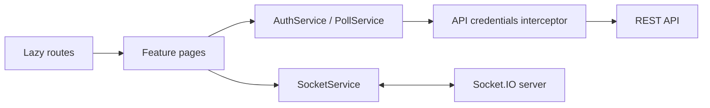

# Arquitetura do client

## Organização

`features` contém páginas orientadas aos casos de uso. `core` concentra infraestrutura compartilhada: sessão, HTTP, modelos, layout e comunicação com enquetes. Nenhuma página conhece URLs da API diretamente.

## Sessão e navegação

Na inicialização, `AuthService.initialize()` consulta a sessão baseada no cookie HTTP-only antes da primeira navegação. O `authGuard` protege criação e edição. O interceptor adiciona `withCredentials` somente para URLs que começam com `environment.apiUrl`.

## Tempo real

Ao abrir o detalhe, a página entra na sala da enquete. Eventos `voteUpdated` possuem contrato tipado e substituem apenas a coleção de opções. Ao destruir a página, o listener e a associação à sala são removidos.

## Performance

Cada página é carregada com `loadComponent`. Assim, login, cadastro e editores não fazem parte do bundle inicial. A regra de status da enquete é uma função pura e testável, compartilhada pelo card e pelo detalhe.
